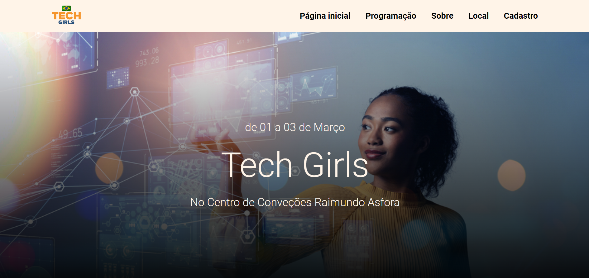

<h1 align="center"> Tech Girls </h1>

 Projeto desenvolvido para o desafio da landing page do programa DESCODIFICADAS. 

## 📕 Índice

- [📋 Sobre](#Sobre)
- [🕹 Tecnologias](#Tecnologias)
- [👩🏻💻 Visualizando o projeto](#Visualizando)
- [📲 Contatos](#Contatos)

# Sobre

 📋 Este projeto se refere a uma Landing Page para divulgação de um evento fictício voltado para a comunidade de mulheres da área de Tecnologia da Informação. O <b>Tech Girls</b>. 

# Tecnologias

- 🧩 **Tecnologias**
  - [HTML5](https://developer.mozilla.org/pt-BR/docs/Web/HTML)
  - [CSS3](https://developer.mozilla.org/pt-BR/docs/Web/CSS)
  - [JS](https://developer.mozilla.org/pt-BR/docs/Web/JavaScript)

# Vizualizando

## Servidor local

  1 - Para verificar a funcionalidade da página no seu servidor é recomendado instalar a extensão Live Server no VsCode.   2 - Clicar no arquivo HTML com o botão direito e selecionar a opção "Open with Live Server".

## Deploy 

Link do projeto: [Clica aqui](https://techgirls.netlify.app/)

 

# Contatos

Sabrynna Lourenço - [Linkedin](https://www.linkedin.com/in/sabrynna-lourenco/) - [Instagram](https://www.instagram.com/sabrynna.ln/) - limasabrynna03@gmail.com
